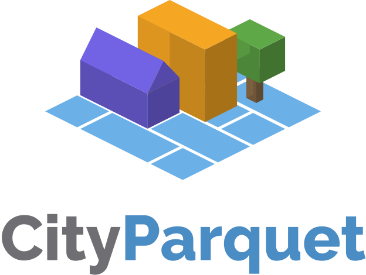

<p align="center">
  
</p>

<h3 align="center">A columnar encoding of the CityGML data model</h3>

<p align="center">
  Store a national-scale 3D city model as Parquet on object storage —<br>
  and query it <em>where it lies</em>, with no database and no server.
</p>

<p align="center">
  <a href="https://cityjson.github.io/cityparquet/"></a>
  <a href="#licence"></a>
  <a href="documents/LICENSE"></a>
  
</p>

<p align="center">
  <a href="https://cityjson.github.io/cityparquet/"><b>Documentation</b></a> ·
  <a href="https://cityjson.github.io/cityparquet/getting-started"><b>Getting started</b></a> ·
  <a href="https://cityjson.github.io/cityparquet/playground"><b>SQL playground</b></a> ·
  <a href="https://cityjson.github.io/cityparquet/specification"><b>Specification</b></a> ·
  <a href="https://cityjson.github.io/cityparquet/benchmark"><b>Benchmark</b></a>
</p>

---

A 3D city model describes a city's buildings, roads and vegetation together with
their **semantics** — a wall is a `WallSurface`, a roof is a `RoofSurface` — not
just their raw geometry. The OGC **CityGML conceptual model** defines _what_ such a
model contains; several encodings write that same information down differently.
CityGML is the XML one, CityJSON the JSON one, 3DCityDB the relational one,
FlatCityBuf the row-based binary one.

**CityParquet is the columnar one** — built for **analytics at scale over object
storage**. It replaces none of the others and takes no position on which is "best";
each serves a different job.

> [!WARNING]
> **Experimental.** The specification is **v0.1.0-draft** and still moving, the
> implementations are catching up to it, and on-disk output may change without
> notice. Do not build anything load-bearing on it yet.

## The problem

CityGML and CityJSON are **text files**. They are excellent for exchange, but they
were never designed for cloud-scale analytics: to run one query you generally
**download the whole file**, then **parse the entire document** into memory before
computing anything. The traditional alternative — a relational database such as
3DCityDB — means **running a server** and **loading the data in** first, and runs
into cost and scalability limits as a collection grows to national size.

CityParquet aims instead at static files on commodity object storage, with nothing
running in front of them.

## How it works

A package is a directory of Parquet files on object storage. A query prunes it
**twice** before a byte moves — column projection drops the LoDs and attributes it
does not need, row-group statistics drop the rows outside the window — and fetches
what is left over plain HTTP range requests. What comes back is still a semantic 3D
model, not a flattened table.

<p align="center">
  
</p>

Concretely: the whole of 3DBAG — every building in the Netherlands, 21.5 million
city objects in one 16.4 GB file — answers `count(*) WHERE object_type = 'Building'`
in about **seven seconds over the network**, because the query touches one column
and never a geometry byte. Narrowing to a neighbourhood with the `bbox` column
brings that window's 3D solids down in about **four**.

## What makes it different

- **Columnar — read only what you need.** Projection pushdown fetches only the
  columns a query names; row-group pruning skips the rows it cannot match. Measuring
  building volumes never touches the attributes, the textures, or the other LoDs.
- **Spatial indexing without a server.** Every row carries a bounding box, and the
  writer can order rows along a Hilbert curve so spatially-near objects share a row
  group. A window query then prunes the groups it cannot overlap — the behaviour of
  a spatial index, from plain files.
- **GeoParquet where the geometry allows.** At LoD0 a CityParquet footprint **is**
  conformant GeoParquet: GeoPandas, GDAL/OGR and QGIS open it as a normal
  geospatial table. Solids step beyond GeoParquet's WKB vocabulary and are declared
  in CityParquet's own `city` footer, which strict GeoParquet readers correctly
  ignore.
- **Discovery-ready.** A package's `metadata.json` is a **STAC Item** using a
  3D-city-model extension, so a catalogue can describe extent, CRS, levels of detail
  and object types **without downloading the data**.

## The layout

A package is a directory split by CityGML module, one row per city object, with
geometry as WKB in a **per-LoD** column paired with a struct carrying what WKB
cannot hold:

```
delft/
  building.parquet          id · object_type · b3_* attributes · bbox
                            geometry_lod0_0    + geometry_properties_lod0_0
                            geometry_lod2_2    + geometry_properties_lod2_2
  transportation.parquet
  metadata.json             a STAC Item (city3d extension)
  materials.parquet         sidecars — written only when the source has them
```

`geometry_properties_lod*` is a native struct holding the semantic surfaces and
shell structure WKB has nowhere to put. Full details in the
[specification](https://cityjson.github.io/cityparquet/specification).

## Quickstart

Try it with **nothing installed** in the [SQL
playground](https://cityjson.github.io/cityparquet/playground) — DuckDB and both
extensions compiled to WebAssembly, running against that 16.4 GB 3DBAG package.

Or query the package from your own DuckDB, with no extension at all:

```sql
INSTALL httpfs; LOAD httpfs;

SELECT count(*) AS buildings
FROM read_parquet('https://cityparquet.open3d.city/data/3dbag/building.parquet')
WHERE object_type = 'Building';
-- 10771547
```

To convert a model of your own, the Rust reference writer produces the full package
with round-trip guarantees:

```sh
git clone --recurse-submodules https://github.com/cityjson/cityparquet.git
cd cityparquet/lib/cityparquet-rs

cargo run --release -p cityparquet-cli -- convert delft.city.jsonl --output delft/
cargo run --release -p cityparquet-cli -- export  delft/ roundtrip.city.jsonl
cargo run --release -p cityparquet-cli -- compare delft.city.jsonl roundtrip.city.jsonl
```

`compare` is the round-trip proof: it checks **semantic** equality, not byte
equality, and it is what every claim of losslessness in this repository rests on.

Or in SQL, with no Rust at all, via the [`cityjson` DuckDB
extension](https://github.com/cityjson/duckdb-cityjson):

```sql
COPY (SELECT * FROM read_cityjsonseq('delft.city.jsonl'))
  TO 'delft.parquet' (FORMAT PARQUET);
```

> [!NOTE]
> Build `cityjson` from source for now. The community registry still serves an
> older build whose columns are named differently — a flat `geometry` blob rather
> than the LoD-suffixed pairs the specification defines.

## What is in this repository

```
documents/     the normative specification — and the reasoning behind it
lib/           the implementations
  cityparquet-rs/    Rust reference reader/writer; owns the encoding
  citylake/          DuckLake-based lakehouse runtime (work in progress)
  duckdb-cityjson/   DuckDB extension: CityJSON/Seq/FlatCityBuf in SQL  (submodule)
  duckdb-3d/         DuckDB extension: 3D solid processing              (submodule)
benchmark/     three benchmark families, their corpora, results and caveats
test/          the cross-module manual walkthrough, and a script that runs it
example/       small inputs to try things on
ai/            design notes; the record of decisions that shaped the above
```

- **The specification** is in [`documents/docs/03-specification/`](documents/docs/03-specification/),
  with the reasoning in `04-design-decisions/` and the genuinely unsettled parts
  in `05-open-questions/`. It is the authority on the format; the
  implementations are catching up to it, and where they disagree with it, they
  are wrong. Rendered at **https://cityjson.github.io/cityparquet/**.
- **The benchmarks** are in [`benchmark/`](benchmark/README.md). Read its README
  before quoting a number — several of the results are deliberately
  non-citable as rankings, and it says which and why.
- **`lib/cityparquet-rs`** is the reference implementation and the place a
  format question gets settled in code.

## Setup

```sh
just setup            # every submodule, recursively (~1.2 GB — see below)
just setup-shallow    # the same at --depth 1: enough for the spec and the Rust library
just --list           # everything you can run from here
```

**A full checkout is large.** The repository itself is small (~5 MB packed), but
the two DuckDB extensions each vendor DuckDB, `extension-ci-tools` and `vcpkg`
as their own submodules, which is where roughly 1.2 GB of `.git/modules` comes
from. If you only want to read or build the specification, or to work on the
Rust library, `just setup-shallow` — or simply cloning without
`--recurse-submodules` — is enough.

## Development

```sh
cd lib/cityparquet-rs && just check   # clippy, tests, schema isolation, fmt, prettier
just plot-test                        # the benchmark plotting suite      (needs uv)
just scripts-test                     # the benchmark shell suites        (needs jq)
just check                            # all three, from the repository root
just docs-build                       # build the specification site      (needs pnpm)
```

The benchmark harness spans two trees on purpose — its code is a crate in
`lib/cityparquet-rs`, its corpora and results are evidence under `benchmark/`
— so every recipe that reaches both lives in the **root** `justfile` and runs
from the repository root. `benchmark/README.md` explains the split.

Contributions are welcome; see [CONTRIBUTING.md](CONTRIBUTING.md) for where a
specification change goes and what has to pass before it lands.

## Related work

CityParquet is the storage layer of a small stack. Beside it sit
[CityJSON](https://www.cityjson.org/) (the model it encodes),
[GeoParquet](https://geoparquet.org/) (which it is a superset of, as far as
their shared WKB vocabulary reaches),
[FlatCityBuf](https://github.com/cityjson/flatcitybuf) (a cloud-optimised binary
CityJSON encoding, and the closest comparison in the benchmarks), and the
[City3D STAC extension](https://github.com/cityjson/city3d-stac-tool) (the
discovery layer that sits in front of a collection of packages).

## Licence

The **software** — everything under `lib/`, `benchmark/`, `test/` and the root
tooling — is dual-licensed under [MIT](LICENSE-MIT) OR
[Apache-2.0](LICENSE-APACHE), at your option.

The **specification and documentation** in [`documents/`](documents/LICENSE) are
licensed under **CC BY 4.0**. A format specification exists to be quoted,
reproduced and built on, which a content licence permits plainly and a software
licence does not.

The submodules under `lib/` carry their own licences.

## Citing

See [CITATION.cff](CITATION.cff). A paper describing the encoding and these
benchmarks is in preparation; this section will point at it once it is
published.
